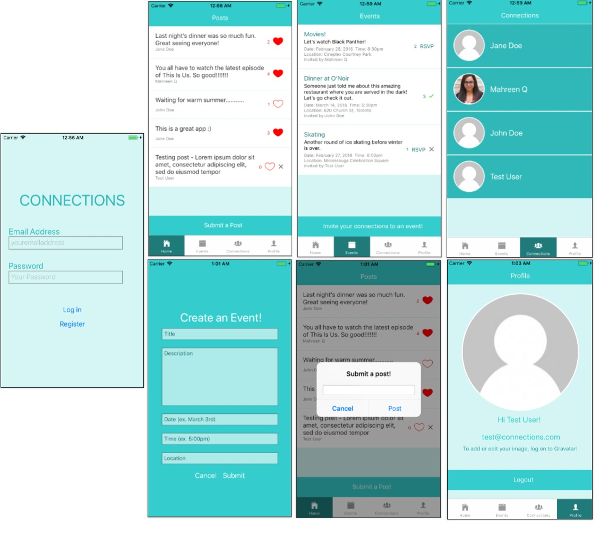

<h1> Connections</h1>

This is a social media mobile application built using React Native.

 
 

The current version of the app allows registered users to submit posts and ideas for events 

Other registered users can 'like' posts and 'RSVP' to events.

Logic is added so only the author of posts and events can delete them.

 

 Firebase is the platform used for authentication and storing data.

 Profile images are rendered using Gravatar

